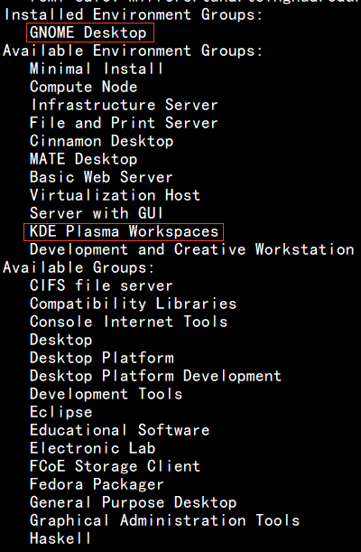

## centos7 安装图形界面

*本教程仅在centos 7 上安装测试过*

1. 首先安装X(X Window System),命令为
```
yum groupinstall "X Window System"
```
2. 检查一下我们已经安装的软件以及可以安装的软件

```
yum grouplist 
```

本图片是安装完了GNOME Desktop 后截图的, KDE 图形界面也不错
3. 安装我们需要的图形界面软件

```
yum groupinstall "GNOME Desktop"
```
4. 安装完成后,通过命令 startx 进入图形界面
```
startx
```


5. 卸载安装的软件
```js
//首先查询安装包：
rpm -qa|grep mysql
// 方法一：
yum -y remove [软件包名字]
// 方法二
// 如果是rpm包
rpm -e [软件包名字]
// 方法三
// tar 包
make uninstall [软件包名字]
```

