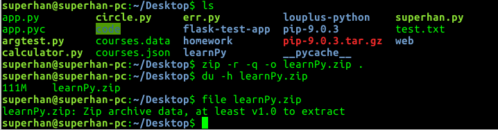
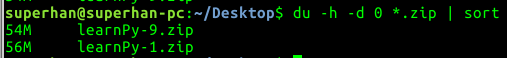

# 文件打包&压缩


文件后缀名|说明
--|--
*.zip |	zip 程序打包压缩的文件
*.rar|	rar 程序压缩的文件
*.7z|	7zip 程序压缩的文件
*.tar|	tar 程序打包，未压缩的文件
*.gz|	gzip 程序（GNU zip）压缩的文件
*.xz|	xz 程序压缩的文件
*.bz2|	bzip2 程序压缩的文件
*.tar.gz|	tar 打包，gzip 程序压缩的文件
*.tar.xz|	tar 打包，xz 程序压缩的文件
*tar.bz2|	tar 打包，bzip2 程序压缩的文件
*.tar.7z|	tar 打包，7z 程序压缩的文件


1. zip 压缩打包程序
```
zip -r -q -o learnPy.zip /home/superhan/Desktop/learnPy
du -h learnPy.zip
file learnPy.zip
```


上面命令将 learnPy 文件夹打包成learnPy.zip 文件。 第一个 `-r`参数表示递归， `-q`参数表示安静模式，即不向屏幕输出信息，`-o`表示输出为文件，其后需要紧跟打包输出的文件名字。 du 查看打包文件的大小。
* **设置压缩级别1-9（9最大，1最小）**
```
zip -r -q -o learnPy.zip /home/superhan/Desktop/learnPy -x ./*.zip
```
最后添加-x 是为了排除上一次创建的zip文件。
* **这里只能用绝对路径，否则不起作用**

```
du -h -d 0 *.zip | sort
```
* `-h` --human-readable 否则不显示 多少M 

* `-d` --max-depth  查看文件的深度


添加参数 `-e` 创建加密的压缩包
```
zip -r -e -o learnPy.zip /home/superhan/Desktop/learnPy
```


2. 使用unzip 命令解压缩zip文件
```
unzip learnPy.zip 
```
使用安静模式，将文件解压到指定目录
```
unzip -q learnPy.zip -d ziptest
```
如果只想查看压缩包里包含的内容加参数 `-l`
```
unzip -l learnPy.zip
```


3. rar 打包压缩

* **rar的参数没有-**
* rm *.rar
* rar a learnPy.rar /home/superhan/Desktop/learnPy 
* 查看不解压文件
* rar l learnPy.rar 
* 删除指定的某个文件  
* rar d learnPy.rar .profile 

3.1 unrar 解压rar 文件
* 全路径解压
```
unrar x learnPy.rar
```
* 去掉路径解压
```
mkdir tmp
unrar e learnPy.rar tmp/
```

4. tar打包工具

tar 是一个打包工具，同时实现了对7z、gzip、xz、bzip2 等工具的支持。

4.1 创建tar包 

tar -cf learnPy 


